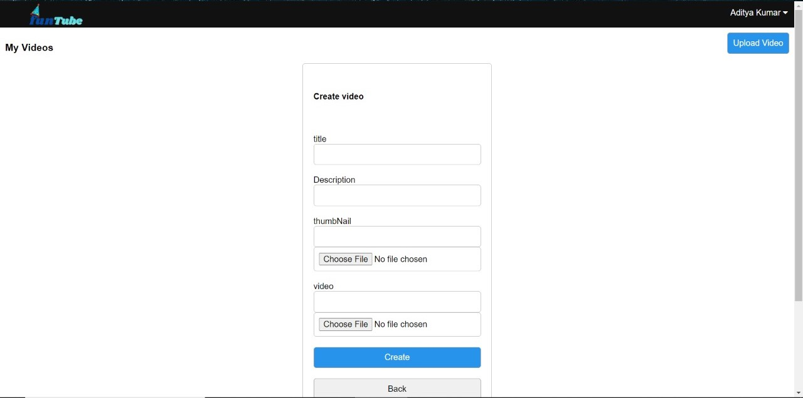

# CipherSchoolsAssesment

Developed WebApp similar to YouTube using MERN stack and AWS S3. Users can view, like or comment on videos uploaded by different channels.Only signed in users can like or comment on video.

 
<h1>Screenshots of WebApp</h1>
 
<h2>Home Screen</h2>
 
</img>
 
<h2>Video Screen</h2>
 
</img>
 
<h2>Profile Screen</h2>
 
</img>
 
<h2>Video Action Screen</h2>
 
</img>
 
<h2>Video Upload Screen</h2>
 
</img>
